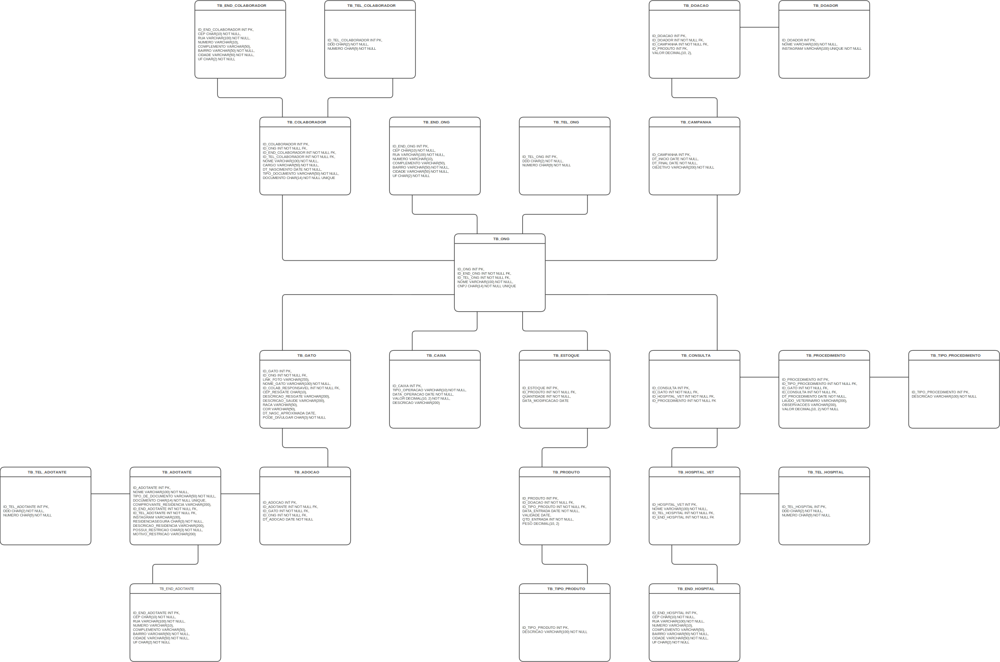

 

<br/><br/>
<p align="center">
    
</p>
<br/>
<p align="center">
    
</p>
<br/><br/>

# db ResGatinhos

Projeto de Modelagem de Banco de Dados Para ONG ResGatinhos.

## 📚 Índice

- [Sobre](#-sobre)
- [Estrutura do Projeto](#-estrutura-do-projeto)
- [Modelos do Banco de Dados](#-modelos-do-banco-de-dados)
- [Como Usar](#-como-usar)
- [Contribuição](#-contribuições)
- [Desenvolvedor](#-desenvolvido-por)
- [Licença](#-licença)

## 🐱 Sobre

O projeto *ResGatinhos* é uma aplicação desenvolvida para auxiliar na criação e organização do banco de dados da ONG ResGatinhos. Ele permite estruturar informações essenciais relacionadas aos processos e ao estoque da ONG, facilitando a geração de relatórios importantes. O objetivo é fornecer uma solução clara e objetiva para ajudar os voluntários a gerenciarem os dados de maneira eficiente.

## 🌟 Estrutura do Projeto

```bash
db-resgatinhos/
├── assets/                     # Arquivos de mídia do projeto
│   ├── imagens/                # Imagens utilizadas no projeto
│   │   └── logo-resgatinhos-de-sao-francisco.jpg # Logo do projeto
│
├── docs/                       # Documentação do banco de dados
│   ├── modelo-conceitual.drawio # Arquivo Draw.io do modelo conceitual
│   ├── modelo-logico.drawio    # Arquivo Draw.io do modelo lógico
│   └── modelo-fisico.sql       # Scripts do modelo físico (com Oracle)
│
├── scripts/                    # (opcional) Scripts automatizados (se necessário)
│   └── create_db.sh            # Script para automatizar criação do banco
│
├── src/                        # Scripts de manipulação do banco
│   ├── insert_data.sql         # Script de inserção de dados
│   ├── update_data.sql         # Script de atualização de dados
│   ├── delete_data.sql         # Script de remoção de dados
│
├── .gitignore                  # Arquivos a serem ignorados pelo Git
└── README.md                   # README geral explicando o projeto
```
## 🎲 Modelos do Banco de Dados

### Modelo Conceitual

O **modelo conceitual** pode ser encontrado no arquivo `docs/modelo-conceitual.drawio`. Ele descreve de maneira simplificada as principais entidades e seus relacionamentos, servindo como uma visão geral do sistema.


### Modelo Lógico

O **modelo lógico** está no arquivo `docs/modelo-logico.drawio`. Ele especifica as tabelas, colunas, tipos de dados e relações entre as tabelas de maneira detalhada, sendo a base para o desenvolvimento do modelo físico.


### Modelo Físico

O **modelo físico** está no arquivo `docs/modelo-fisico.drawio`. Este modelo contém os scripts para criação de tabelas, índices, relacionamentos e outros elementos necessários para implementar o banco de dados no Oracle.



## 👾 Como Usar

Para utilizar este projeto, siga as etapas abaixo:

### 1. Clonar o Repositório

Na pasta desejada utilizando o terminal clone o repositório com o comando:
```bash
git clone https://github.com/Projeto-ResGatinhos/db-resgatinhos.git
```

### 2. Acessar a Pasta do Repositório:

Utilize o comando:
```bash
cd db-resgatinhos
```

### 3. Abrir os Arquivos no VS CODE:

Após acessar a pasta abrir o repositório com o comando:
```bash
code .
```

### 4. Instalar Extensões Necessárias:

Instale as seguintes extensões no VS Code para trabalhar com este projeto:

- [Oracle Developer Tools for VS Code (SQL and PLSQL)](https://marketplace.visualstudio.com/items?itemName=Oracle.oracledevtools)
- [Draw.io Integration](https://marketplace.visualstudio.com/items?itemName=hediet.vscode-drawio)

### 5. Acessar os modelos desejados se guiando pela `estrutura do projeto`.

## 🧑‍🤝‍🧑 Contribuições

Diretrizes sobre como contribuir para o projeto com *forks*, *pull requests*, etc.

### Passos para contribuição:

1. Clone o repositório:

    ```bash
    git clone https://github.com/Projeto-ResGatinhos/db-resgatinhos.git
    ```

2. Crie uma nova branch:

    ```bash
    git checkout -b feature/NAME
    ```

3.	Siga os padrões de commit do [Conventional Commits v1](https://www.conventionalcommits.org/en/v1.0.0/).

    ```bash
    git commit -m "feat(db): create users table"
    ```

4.	Abra um Pull Request explicando o problema resolvido ou a funcionalidade adicionada. Se houver modificações visuais, anexe uma captura de tela e aguarde a revisão!

    [Mais detalhes de como criar uma solicitação de pull](https://docs.github.com/pt/pull-requests/collaborating-with-pull-requests/proposing-changes-to-your-work-with-pull-requests/creating-a-pull-request)

## ☕️ Desenvolvido por

<table align="center">
    <tr>
        <td align="center">
            <a href="https://github.com/ArielSpencer">
                
            </a>
            <p>Ariel Spencer</p>
        </td>
        <td align="center">
            <a href="https://github.com/AnaLuizaClaver">
                
            </a>
            <p>Ana Luiza</p>
        </td>
        <td align="center">
            <a href="https://github.com/Mariel1451">
                
            </a>
            <p>Mariel Alejandra</p>
        </td>
    </tr>
    <tr>
        <td align="center">
            <a href="https://github.com/Batisli">
                
            </a>
            <p>Livia Rodrigues</p>
        </td>
        <td align="center">
            <a href="https://github.com/kolankowsky">
                
            </a>
            <p>Geovanna Kolankowsky</p>
        </td>
        <td align="center">
            <a href="https://github.com/Luiz-Menezes19">
                
            </a>
            <p>Luiz Henrique</p>
        </td>
    </tr>
</table>

## 📝 Licença

Este projeto está sob a [Licença MIT](https://opensource.org/licenses/MIT).
